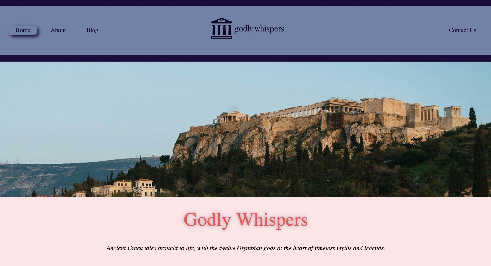

I set out to create a webpage using HTML, CSS and Vanilla JS whre the content of the website came from a WP REST API that I managed.

## Description

This is a project I created as a student at Noroff as a exam project. I got to choose the theme for the website but it had to use WP REST API and add content dynamically. It is a website that is built and designed to provide an engaging user experience. I wanted to create an inviting blog that gave the user a feeling of being in Ancient Greece while reading about the Greek Gods.

This is to showcase skill in frond-end development. Such as:

- Implemented dynamic content loading to fetch and display posts without needing a full page refresh.
- Used the DOM Manipulation API to create interactive features, such as scripture pop-ups and a submission form.
- Added event listeners for smooth navigation and user interactions, ensuring a seamless experience.
- Applied principles of user-centered design to ensure intuitive navigation and an engaging user experience.
- Integrated dynamic content to provide users with fresh and interesting reading materials.
- Leveraged Netlify for seamless deployment, continuous integration, and hosting, ensuring high performance and reliability.

## Built With

On this project I have used HTML, CSS and Vanilla Javascript.

## Getting Started

### Installing

In order to run the websites locally, one can do as follows:

1. Clone the repo, this can be done for example, with the git command line tool (if installed):

```bash
gh repo clone Kateve52911/project-exam-1-kathrine
```

2. Install Live Server in VS Code (or equivalent if using another IDE) and then it can be run from within.

### Running

To run the app, open VS Code (or equivalent), and then right click on the ´index.html´ file and start with Live Server from the menu.

## Contributing

In order to contribute, create a PR in this repo. Add @Kateve52911 as a reviewer.

## Contact

[My portfolio website](https://www.kathrinesportfolio.netlify.app)

[My LinkedIn page](https://www.linkedin.com/in/kathrine-mellem-evensen-6855b612b)

## Acknowledgments

Many thanks to my very patient partner who has answered all my questions throughout the build of this website.
